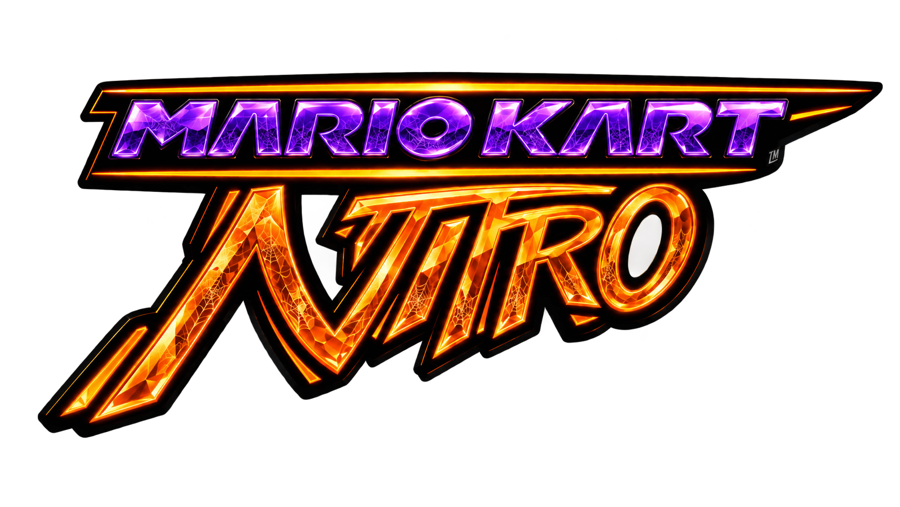

# Mario Kart Nitro

---

## What is this?

Mario Kart Nitro is a Mario Kart Wii mod distributed through its own lightweight
Windows launcher, so nobody has to manage Riivolution XML files, Dolphin
settings, and folder structures by hand.

## Features

- **One-click play** – pick your Dolphin and your game, press Play. The launcher
  stages the mod into Dolphin's `Load/Riivolution` folder and starts the game.
- **Automatic mod updates** – the modpack is synced from the
  [Nitropack](https://github.com/mkwiichannel/Nitropack) repository. Only files
  that changed are downloaded and every file is hash-checked.
- **Self-updating launcher** – new launcher builds are applied in place, with no
  reinstalling or manual replacing.
- **Mii editor** – a live close-up preview with visual pickers for every part
  (face, hair, brows, eyes, nose, mouth, beard, glasses, …), colour swatches and
  sliders.
- **Fits your window** – every page fits the window without page scrolling
- **16 languages** – see `translations.json`.
- **Light on resources** – a single standalone `.exe`, tuned to load fast and stay
  smooth on modest hardware.

## Requirements

- Windows 10/11, 64-bit (nothing else to install - the launcher is a single standalone `.exe`)
- [Dolphin Emulator](https://dolphin-emu.org/) with Riivolution support
- A legally obtained Mario Kart Wii ISO/WBFS (not provided here or anywhere by
  this project)

## Getting started

1. Grab the latest `MarioKartNitro.exe` from the [Releases](../../releases) page.
2. Run it. On first launch it asks for your Dolphin folder and your game file.
3. The mod content is downloaded automatically.
4. Press Play. Updates are checked every time the launcher opens.

## Building

The launcher is a C# / WPF app (.NET 8). Install the .NET 8 SDK on your build PC
only, then run `build.bat`. The result is a single self-contained
`dist\MarioKartNitro.exe`. The older Python builds remain as `build_qt.bat` and
`build_web.bat`.

## How updates work

| What | Source | How it applies |
|---|---|---|
| Modpack | `mkwiichannel/Nitropack` (GitHub) | Incremental, hash-checked sync into Dolphin's Riivolution folder |
| Launcher | `launcher_nitro` in [`manifest.json`](manifest.json) | "Update available" prompt, then the `.exe` is swapped and relaunched |

The time of the last modpack sync and launcher update is stored in the launcher
config and shown on the version pill.

## License

Released under the [GNU General Public License v3.0](LICENSE.txt).

Third-party components and their licenses are listed in
[THIRD_PARTY_NOTICES.md](THIRD_PARTY_NOTICES.md).

## Community

Join the [Discord](https://discord.gg/AhkHNPG65G) for support, updates,
and to chat with the community.

---

Developed by Dom (mkwiichannel).
